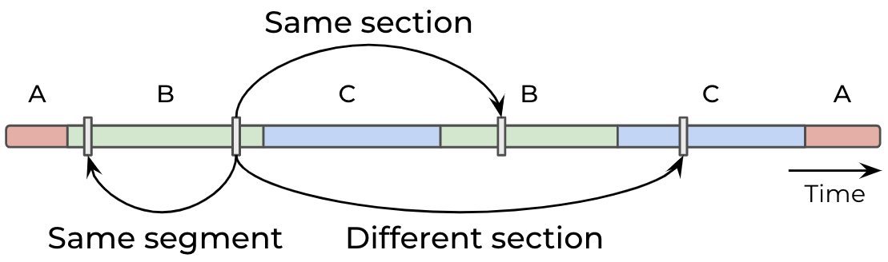

<div  align="center">
  
# LinkSeg: Using Pairwise Link Prediction and Graph Attention Networks for Music Structure Analysis
  
[Morgan Buisson](https://morgan76.github.io/)<sup>1</sup>,
[Brian McFee](https://brianmcfee.net/)<sup>2,3</sup>,
[Slim Essid](https://slimessid.github.io/research/)<sup>1</sup> <br>
<sup>1</sup>  LTCI, Télécom Paris, Institut Polytechnique de Paris, France <br> <sup>2</sup>  Music and Audio Research Laboratory, New York University, USA <br> <sup>3</sup> Center for Data Science, New York University, USA
  
<p align="center">

</p align="center">
</div>

This repository contains the official [PyTorch](http://pytorch.org/) implementation of the paper [Using Pairwise Link Prediction and Graph Attention Networks for Music Structure Analysis](https://hal.science/hal-04665063/) 
presented at ISMIR 2024. 

We introduce **LinkSeg**, a novel approach to music structure analysis based on pairwise link predictions. This method consists in predicting whether any pair of time instants within a track belongs to the same structural element (segment or section). This problem comes down to classifying each individual component (i.e. link) of the track's self-similarity matrix ("same-segment", "same-section" or "different section"). The link features calculated from this task are then combined with frame-wise features through a graph attention module to effectively predict segment boundaries and musical section labels. 

This project is focused on the segmentation of popular music genres, predicted section labels follow a 7-class taxonomy containing: "Intro", "Verse", "Chorus", "Bridge", "Instrumental", "Outro" and "Silence". 

This repository provides code for training the system from scratch and some pre-trained checkpoints for predicting the structure of new tracks. 

## Table of Contents
0. [Requirements](#requirements)
0. [Dataset](#dataset)
0. [Training](#training)
0. [Inference](#inference)
0. [Citing](#citing)
0. [Contact](#contact)

## Requirements
```
conda create -n YOUR_ENV_NAME python=3.8
conda activate YOUR_ENV_NAME
pip install -r requirements.txt
```

## Dataset
The dataset structure follows that of the [MSAF](https://ismir2015.ismir.net/LBD/LBD30.pdf) package:
```
dataset/
├── audio                   # audio files (.mp3, .wav, .aiff)
├── audio_npy               # audio files (.npy)
├── features                # feature files (.json)
└── references              # references files (.jams) (if available, necessary for training)
```

To preprocess some dataset, run:
```
python preprocess_data.py --data_path {dataset_path}
```
This will handle the creation of /audio_npy and /features files. 

## Training
To train a new LinkSeg model, run:
```
python train.py --data_path {dataset_path}
```

The default label taxonomy contains 7 section labels: Silence, Intro, Verse, Chorus, Bridge, Instrumental and Outro. A second taxonomy containing Pre-chorus and Post-chorus labels can be used:
```
python train.py --data_path {dataset_path} --nb_section_labels 9
``` 

## Inference
To make predictions using a trained model, first make sure that the test dataset is processed: 
```
python preprocess_data.py --data_path {test_dataset_path}
```

Then run:
```
python predict.py --test_data_path {test_dataset_path} --model_name {path_to_model}
```

To use the 7-class pre-trained model (on a 75% split of Harmonix), run:
```
python predict.py --test_data_path {dataset_path} --model_name ../data/model_7_classes.pt
```

By default, segmentation predictions will be saved in .jams file format under the dataset/predictions/ directory. 


## Segmentation Example

<div  align="center">
<p align="center">

</p align="center">
</div>

Segmentation results for the track *M83 - Midnight City* from the Harmonix dataset. The top two rows display the class activation and boundary curves over time. The bottom rows show the final predictions and the reference annotations. Black and red dotted lines indicate predicted and annotated segment boundaries.

## Citing
```
@inproceedings{buisson:hal-04665063,
  title={Using Pairwise Link Prediction and Graph Attention Networks for Music Structure Analysis},
  author={Buisson, Morgan and McFee, Brian and Essid, Slim},
  booktitle={International Society for Music Information Retrieval (ISMIR)},
  year={2024}
}
```

## Contact
morgan.buisson@telecom-paris.fr
